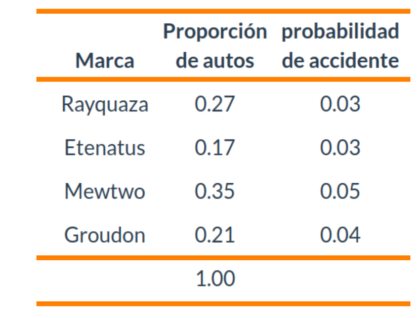

---
title: <span style="color:#235784"> </span>  
subtitle: <span style="color:#235784">**Unidad 2.2**</span> 
author: "dgonzalez "
output:
  html_document:
    toc: no
    toc_depth: 2
    toc_float: yes
    code_folding: hide
    theme: flatly
---    


```{r setup, include=FALSE}
options(htmltools.dir.version = FALSE)
knitr::opts_chunk$set(
  fig.width=9, fig.height=3.5, fig.retina=3,
  out.width = "100%",
  cache = FALSE,
  echo = TRUE,
  message = FALSE, 
  warning = FALSE,
  hiline = TRUE
)
# colores
c0= "#FFCC00"
c1= "#FFAD42"
c2= "#FF5A42"
c3= "#E1286F"
c4= "#4983F6"
c5= "#783AC7"
c6= "#2C5697" # AZZUL INSTITUCIONAL
c7= "#F7F7F7" # FONDO GRIS CLARO WEB

paleta4=c(c0,c1,c2,c3)


library(forcats)
library(patchwork)
library(lubridate)
library(ggplot2)
library(gridExtra)
library(cowplot)
library(summarytools)

#library(dviz.supp)
```


</br></br></br>

```{r, echo=FALSE, out.width="100%", fig.align = "left"}
knitr::include_graphics("img/banner002.png")
```
</br></br></br>


<div class="box1 with-label">
<div class="label">Problema 1</div>

</br>

:::: {style="display: flex;"}
::: {}

Una compañia de seguros de automóviles trabaja con cuatro tipo de autos :  Rayquaza, Etenatus, Mewtwo y Groudon, sobre los que cuenta con la información que se muestra en la siguiente tabla.

Construya un diagrama de árbol que represente la información suministrada y a partir de los resultados obtenidos ayude al gerente de la compaía quien esta interesado en conocer cual marca tiene mayor probabilidad de accidente si se conoce que ha tenido un accidente. Esto le ayudará a realizar ajustes en los precios de las polizas.
  
:::
::: {}


```{r, echo=FALSE, fig.align = "center"}

```

<!-- | Marca    |Proporción de autos       | probabilidad de accidente | -->
<!-- |:--------:|:------------------------:|:-------------------------:| -->
<!-- | Rayquaza | 0.27                     | 0.03                      | -->
<!-- | Etenatus | 0.17                     | 0.03                      | -->
<!-- | Mewtwo   | 0.35                     | 0.05                      | -->
<!-- | Groudon  | 0.21                     | 0.04                      | -->
<!-- |          | 1.00                     |                           | -->
:::
::::


</div>

<br/><br/><br/>

<div class="box1 with-label">
<div class="label">Problema 2</div>

</br>

Un dispositivo sirve para identificar una cierta enfermedad. Si alguien está enfermo, hay un 90 % de posibilidades de que la prueba sea positiva. Si no está enfermo hay todavía un 1 % de posibilidades de que la prueba sea positiva. Aproximadamente el 1 % de la población está enferma. Smith pasa la prueba y resulta positiva. La probabilidad de que tenga la enfermedad es? (Carmen Diaz-2005)

</div>

<br/><br/><br/>


<div class="box1 with-label">
<div class="label">Problema 3</div>

</br>


En una ciudad hay 60 hombres y 40 mujeres por cada 100 habitantes. La mitad de los hombres y una tercera parte de las mujeres fuman. Si se selecciona al azar un fumador, ¿qué es más probable, que sea hombre o mujer? (Carmen Diaz-2005)

</div>

<br/><br/><br/>


<div class="box1 with-label">
<div class="label">Problema 4</div>

</br>


En una empresa de desarrollo de software, se evaluó a un grupo de 1000 desarrolladores en dos aspectos clave: **nivel de competencia en algoritmos ** y **aptitud para el trabajo en equipo**. Se encontró que 500 desarrolladores eran aptos para el trabajo en equipo, de los cuales 300 tenían un **alto nivel de competencia en algoritmos**. De los 400 desarrolladores con alta competencia en algoritmos, 300 también resultaron **aptos para el trabajo en equipo**.

¿Son los eventos A: "tener alta competencia en algoritmos" y B: "ser apto para el trabajo en equipo" independientes?
</div>


<br/><br/><br/>

<div class="box1 with-label">
<div class="label">Problema 5</div>

</br>

En un proyecto de urbanismo, se están evaluando tres tipos de pavimentos utilizados en una ciudad: asfalto convencional, concreto permeable y adoquines de piedra. Se ha determinado que el 25% de las calles están pavimentadas con asfalto convencional, el 50% con concreto permeable, y el 25% con adoquines de piedra.

Además, se ha observado que la probabilidad de que una calle permanezca en buen estado después de 5 años es 80% para el asfalto convencional, 60% para el concreto permeable, y 40% para los adoquines de piedra.

Si se selecciona al azar una calle que se encuentra en buen estado después de 5 años, ¿cuál es la probabilidad de que esté pavimentada con asfalto convencional?
</div>

<br/><br/><br/>

<div class="box1 with-label">
<div class="label">Problema 6</div>

</br>

En un estudio sobre materiales para la construcción de puentes peatonales, se analizan dos tipos de concreto: concreto reforzado (tipo A) y concreto de alta resistencia (tipo B). En el estudio, se encontró que el 40% de los puentes peatonales están construidos con concreto reforzado (A) y el 60% con concreto de alta resistencia (B).

Además, se supervisó que el 90% de los puentes construidos con concreto reforzado cumplen con los estándares de resistencia después de 10 años, mientras que el 75% de los puentes construidos con concreto de alta resistencia cumplen con estos estándares en el mismo período.

Si se selecciona al azar un puente que cumple con los estándares de resistencia después de 10 años, ¿cuál es la probabilidad de que haya sido construido con concreto reforzado (tipo A)?

</div>

<br/><br/><br/>


