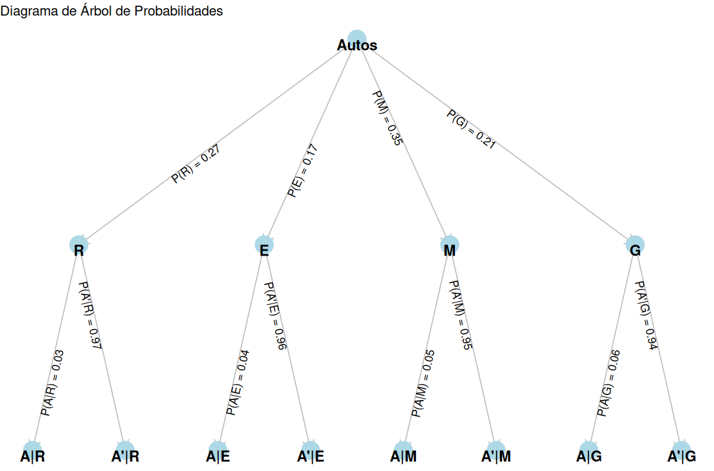

---
title: <span style="color:#235784"> </span>  
subtitle: <span style="color:#235784">**Módulo 3**</span> 
author: "dgonzalez "
output:
  html_document:
    toc: no
    toc_depth: 2
    toc_float: yes
    code_folding: hide
    theme: flatly
    css: style.css
---      


```{r setup, include=FALSE}
knitr::opts_chunk$set(echo = TRUE, comment = NA)
library(gt)
library(tidyverse)
```

**PONTIFICIA UNIVERSIDAD JAVERIANA CALI**  
Departamento de Ciencias Naturales y Matemáticas  
300MAE018 Estadística para la toma de decisiones - grupo F  

<div style="text-align: right;">
<strong>Profesor:</strong> Daniel Enrique González Gómez  
Cali, febrero 27 de 2025  
</div>

<div style="text-align: center;">
<strong>PRIMER EXAMEN PARCIAL</strong>
</div>

<br/><br/>

## Punto 1

Una compañía de seguros de automóviles trabaja con cuatro tipos de autos: **Rayquaza, Etenatus, Mewtwo y Groudon**, sobre los que cuenta con la siguiente información:

| Marca            | Proporción de autos | Probabilidad de **A**ccidente |
|-------------------|--------------------|-------------------------------|
| **R** : Rayquaza  |   $P(R)=0.27$      |   $P(A|R) =0.03$              |
| **E** : Etenatus  |   $P(E)=0.17$      |   $P(A|E) =0.04$              |
| **M** : Mewtwo    |   $P(M)=0.35$      |   $P(A|M) =0.05$              |
| **G** : Groudon   |   $P(G)=0.21$      |   $P(A|G) =0.06$              |

Construya un diagrama de árbol que represente la información suministrada y a partir de los resultados obtenidos, ayude al gerente de la compañía a conocer qué marca tiene mayor probabilidad de accidente si se sabe que ha ocurrido un accidente (**A**). Construya un listado de mayor a menor.

<br/><br/>

### **Solución**


```{r, echo=FALSE, out.width="80%", fig.align = "center"}

```


A partir de la identificación de las probabilidades de la tabla procedemos a calcular las probabilidades conjuntas:

```{r}
P = c(0.27, 0.17, 0.35, 0.21)
C = c(0.03,0.04,0.05,0.06)

P*C
```


```{r}
p = P*C/sum(P*C)
names(p) = c("(3):P(R|A)", "(4):P(E|A)", "(1):P(M|A)", "(2):P(G|A)" )
p

```

<pre>  
(1) : P(M|A) = 0.3888889 
(2) : P(G|A) = 0.2800000 
(3) : P(R|A) = 0.1800000 
(4) : P(E|A) = 0.1511111 
</pre>  
  
 
<br/><br/><br/>

## Punto 2

Un una fabrica de de jabones para el aseo personal realizó un estudio con el objetivo de mejorar una linea de este producto, mediante la medición de los pesos (en onzas)  de 50 barras.

Los resultados obtenidos y algunos cálculos sobre los datos se presentan a continuación :

```{r, echo=FALSE}
x = c(20.3, 19.2, 18.8, 18.5, 18.5, 18.3, 18.3, 18.2, 18.1, 17.7, 17.6,
14.4, 17.4, 17.4, 17.3, 17.3, 17.1, 17.0, 16.6, 16.5, 16.5,  16.5,
16.4, 16.3, 16.2, 16.2, 16.1, 15.9, 15.9, 15.8, 15.8, 15.7, 15.6,
15.6, 15.2, 15.1, 14.8, 14.6, 14.3, 14.3, 14.1, 13.8, 13.7, 13.6,  
13.3, 13.1, 12.8, 12.7, 12.6,  11.6)
stem(x)

# sum(x)
# sum(x^2)
# sum(x^3)
# sum(x^4)
# sd(x)
```

* $\displaystyle\sum_{i=1}^{50} x_{i} = 798.6$ 

* $\displaystyle\sum_{i=1}^{50} x_{i}^2  = 12941.46$ 

* $\displaystyle\sum_{i=1}^{50} x_{i}^3 =  212596.4$ 

* $\displaystyle\sum_{i=1}^{50} x_{i}^4 = 3537246$ 

* $\sqrt{\dfrac{\displaystyle\sum_{i=1}^{50} (x_{i}-\bar{x})^2}{49}} = 1.949468$ 

<br/><br/>

Por política de la empresa, el peso del producto debe estar en un 90% de los casos entre mas o menos dos onzas al rededor del peso especificado en la etiquete del producto (16.0 onzas). Un segundo criterio importante es el de establecer si en los datos obtenidos se presentan datos atípicos y si los valores se pueden clasificar como homogéneos, teniendo como referencia un indicador del 10%. En caso de no cumplimiento de los criterios de calidad será necesario detener la producción y llamar a la empresa de mantenimiento para que realice los ajustes necesarios.


Debido a que la muestra obtenida constituye una muestra representativa del proceso, el director de la empresa le pide le ayude a validar los resultados y le indique que decisión debe tomarse a partir de la información obtenida

<br/><br/>

### **Solución**

a. 90% de los casos entre mas o menos dos onzas al rededor del peso especificado en la etiquete del producto (16.0 onzas)

```{r}
media = 798.6/50
L = c(media - 2,  media + 2)
L


```

Los valores que cumplen esta política son 32 de los 50 barras de la muestra, es decir el 64%. **NO CUMPLE EL PRIMER CRITERIO**.

<pre>
  14 | 133468
  15 | 126678899
  16 | 122345556
  17 | 01334467
</pre>


b. Si en los datos obtenidos se presentan datos atípicos

Para ello requerimos determinar los dos límites que se calcula con los cuartiles 1 y 2.


```{r}
# Q1 = X12.5
Q1 = (14.3+14.4)/2

# Q2 = X25
Q2 = 16.1
  
# Q3 = X37.5  
Q3 = (17.3+17.4)/2

L = c(Q1-1.5*(Q3-Q1), Q3+1.5*(Q3-Q1))

names(L)= c("LI", "LS")
L


```

Como ningun valor se encuentra por debajo de 9.85, ni por encima de 21.85, podemos afirmar que **NO EXISTEN DATOS ATÍPICOS**.


c. Si los valores se pueden clasificar como homogéneos


Para determinar si los valores de la muestra son homogeneos o no se debe calcular el coeficiente de variación.

```{r}
desviacion = 1.949468/49

CV = desviacion/media *100

CV

```

Como el coeficiente de variación es del 0.25%, indica que los datos recogidos en la muestra son **HOMOGENEOS**.


En conclusión no se cumplen **todos** los criterios fijados por la empresa. Al incumplirse el primer criterio, se recomienda llamar a la empresa encargada del mantenimiento para que realice los ajustes requeridos y detener la producción hasta tanto no se realicen los ajustes. 

Tambien que despues de hacer realizado los ajustes, nuevamente se tome una muestra y se analicen los requerimientos.


